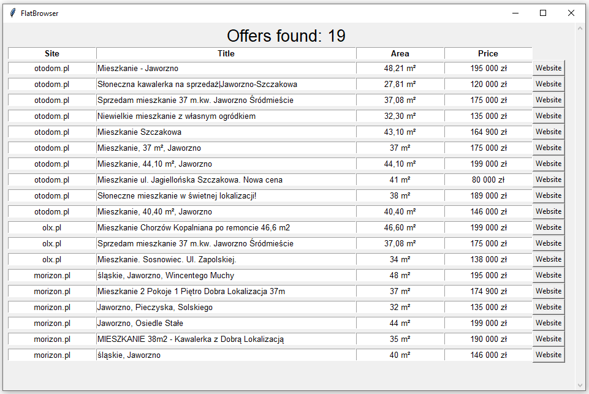

# Flat-browser
> This application enables to browse flat offers in chosen city, price and surface area. There are console and window version of this app.

## Table of contents
* [General info](#general-info)
* [Screenshots](#screenshots)
* [Technologies](#technologies)
* [Setup](#setup)
* [Features](#features)
* [Status](#status)
* [Contact](#contact)

## General info
I made this application while I was looking for an apartment to buy. I figured it takes a long time to check each page separately and I decided to shorten the process. This program enables faster and easier viewing of housing websites.

## Screenshots
### Window Version

### Console Version

## Technologies
* Python 3.8.1
* BeautifulSoup4
* requests
* Tkinter
* datetime
* relativedelta

## Setup
To install app you will need to run command to install demanded packages:

> pip install -r requirements.txt

After that just run console_version/main.py or window_version/main.py using your IDE.
## Features
List of features ready and TODOs for future development
* Selection of the city in which the apartment is to be searched for
* Selection of apartment area (from - to)
* Selection of apartment price (from - to)
* Selection of days from the date of the offer
* Searching otodom.pl, olx.pl and morizon.pl pages and providing the results in the form of a list with buttons to redirect to chosen offer
## Status
The project is ready for use, requires minor improvements.

## Contact
Created by [@matedawid](https://linkedin.com/in/matedawid) - if you have any questions, just contact me!
